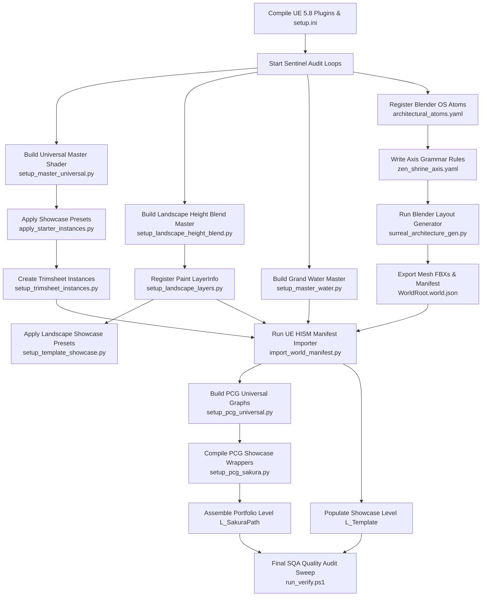

# Task Dependency Graph — Environment Portfolio Platform

This document defines the production task sequence and dependencies for compiling materials, generating layouts, importing assets, and running quality assurance sweeps.

---

## 1. Task Dependency Diagram

The following Mermaid diagram maps the prerequisite relationships between setup, generation, importing, placement, and final scene production.

---

## 2. Execution Runbooks

Agents must execute tasks in the specified sequential order to prevent reference errors or compile failures.

### 2.1 Material Compilation Sequence (MPA)
This sequence must run to compile all master materials and spawn instances before geometry or layouts are imported.
1.  **Project Prep**: Confirm `DefaultEngine.ini` has Substrate enabled.
2.  **Universal Master Compile**: Run `setup_master_universal.py` (adds parameters and groups).
3.  **Showcase Presets**: Run `apply_starter_instances.py` (spawns `MI_Show_*` instances).
4.  **Trimsheets Presets**: Run `setup_trimsheet_instances.py` (spawns Layer A/B trim instances).
5.  **Landscape compile**: Run `setup_landscape_height_blend.py` followed by `setup_landscape_layers.py`.
6.  **Water compile**: Run `setup_master_water.py` (wires caustics and spawns water presets).

### 2.2 Layout & World Import Sequence (PGA ➔ WIA)
This sequence handles layout creation in Blender, mesh export, and coordinate conversion into Unreal Engine.
1.  **Kits & Snaps**: Update `architectural_atoms.yaml` in `deploy/surreal_os/`.
2.  **Grammar Definitions**: Confirm axis layouts in `zen_shrine_axis.yaml`.
3.  **Spawn Plan**: In Blender Edit Mode, generate plan paths and vertex groups (`is_keep`, `is_gate`, `is_sacred`).
4.  **Export Manifest**: Execute Blender "Bake & Export UE5" to write mesh FBXs and `{WorldRoot}.world.json`.
5.  **Import Manifest**: In Unreal, run `import_world_manifest.py` pointing to the JSON path.

### 2.3 Point Scatter Placement Sequence (PPA)
This sequence manages scattering foliage, rocks, and debris around imported layouts.
1.  **Standards Check**: Verify tags (`PCG_Ground`, `PCG_Exclude`) in `pcg_portfolio_standards.py`.
2.  **Universal PCG Build**: Run `setup_pcg_universal.py` (generates foliage density and rock scatters).
3.  **Style PCG Build**: Run `setup_pcg_sakura.py` (wires ground cover wrappers and maps meshes to HISM).
4.  **Prune dead systems**: Run `fix_pcg_dead_systems.py --apply` to clean deprecated nodes.

### 2.4 Quality Assurance & Verification Sequence (SQA)
This sequence runs audits to ensure that redirectors are fixed, assets are named correctly, and scenes compile cleanly.
1.  **Redirector Clean**: Run `fix_migration_redirectors.py` to fix up asset pathways.
2.  **PCG Audit**: Run `audit_pcg_portfolio.py` (checks PCG plugin state and point count ranges).
3.  **Material Audit**: Run `audit_material_library.py` (checks EnvSandbox masters and instances).
4.  **Unified Check**: Run `powershell deploy/run_verify.ps1 -Mode all` to ensure that all layout metrics and style files compile cleanly.
